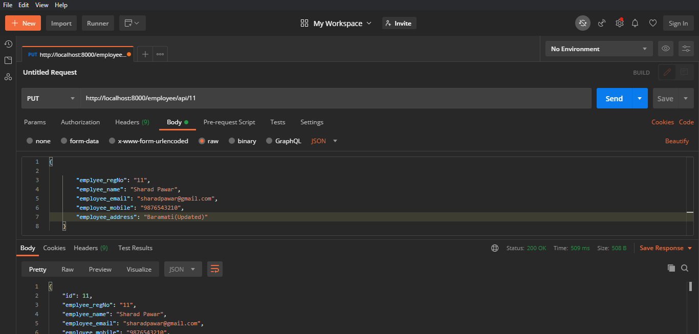

## Intructions to Install the Employeed DRF project

1. Create Virtual Environment and activate it
 

   **Clone the repository**
    ```
    git clone https://github.com/tadiparChinese/Employee_DRF.git
    ```

   Once inside the project folder run: 

    ```
    virtualenv env
    ```

   Activate virtualenv 
   On Windows, virtualenv (venv) creates a batch file called 

   ```
   \env\Scripts\activate.bat
   ```

2. Install required libraries with Requirements.txt file
   ```
    pip install -r requirements.txt
   ```

3. Creating a new Django Project and Initial setup for DRF

    ```
    python manage.py makemigrations

    python manage.py migrate

    python manage.py runserver
    ```

4. Login Password
    ```
    username: admin
    
    password: admin
    ```

## LIST API View for Employee Details
     http://localhost:8000/employee/api
     
   
   
   
   


## CREATE API View for Employee Details (POST)
     http://localhost:8000/employee/api/create
   
   
   
   
   
   
   

## UPDATE API View for Employee (PUT or PATCH request)
     http://localhost:8000/employee/api/<employee_id>
     
     example:
     http://localhost:8000/employee/api/1
     
   
   
   
   
     


## DELETE API View for Employee Details
     http://localhost:8000/employee/api/<employee_id>/delete

     example:
     http://localhost:8000/employee/api/1/delete
     
   
   
   
   
     
     
## Feedback
Any suggestion and feedback is welcome. You can e-mail to me on <a href="pratikvnagdeve@gmail.com">pratikvnagdeve@gmail.com</a>
